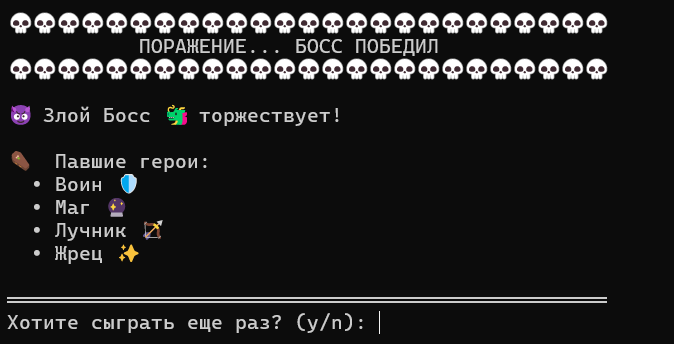
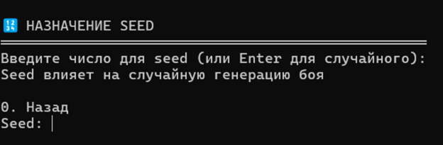
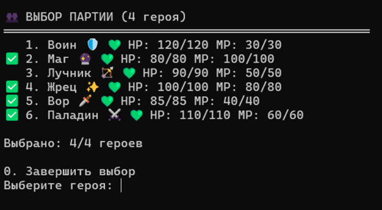
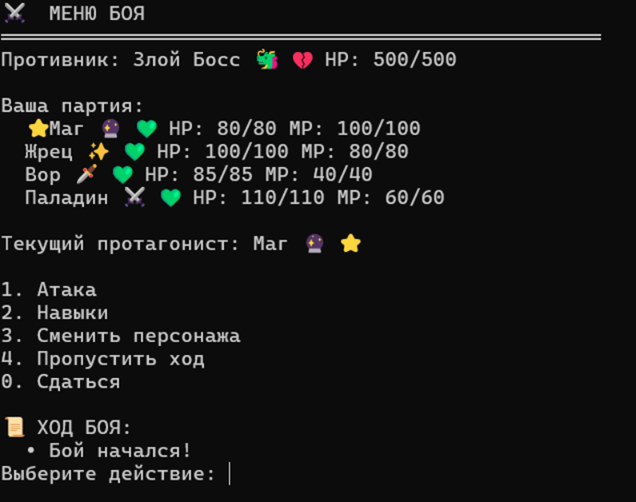
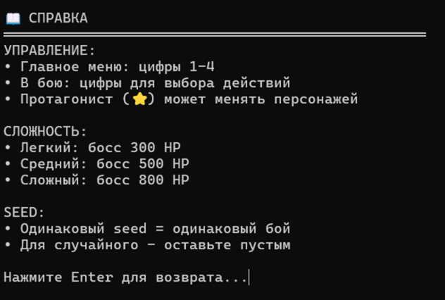
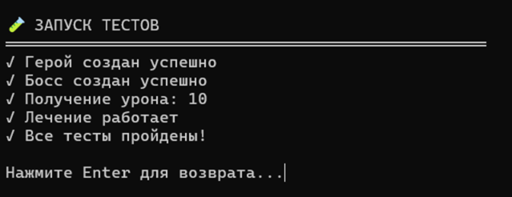
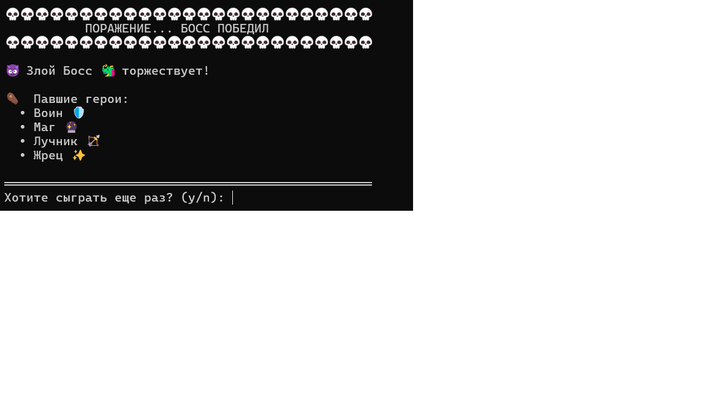

# Party vs Boss

Полнофункциональная текстовая RPG игра на Python с системой меню.

## Функционал игры

Основные меню:
- Главное меню - 4 пункта управления
- Выбор сложности - 3 уровня (Легкий/Средний/Сложный)
- Назначение seed - для детерминированной генерации
- Выбор партии - 4 героя из 6 доступных классов

Меню боя:
- Меню боя - обзор состояния битвы
- Меню атаки - выбор типа атаки  
- Меню навыков - использование специальных способностей
- Меню смены персонажа - смена протагониста (только в бою)

Дополнительно:
- Справка - правила игры и управление
- Тесты - модуль тестирования функционала
- Система seed - повторяемость игровых сессий

## Классы героев
- Воин - танк, высокая защита
- Маг - мощные заклинания, много маны
- Лучник - критические атаки
- Жрец - лечение и поддержка
- Вор - смертельные удары
- Паладин - сбалансированный боец

## Запуск
cd src
python main.py

## Скриншоты

## Технологии
- Python 3.8+
- Объектно-ориентированное программирование
- Модули: random, time, sys
- Система меню и навигации